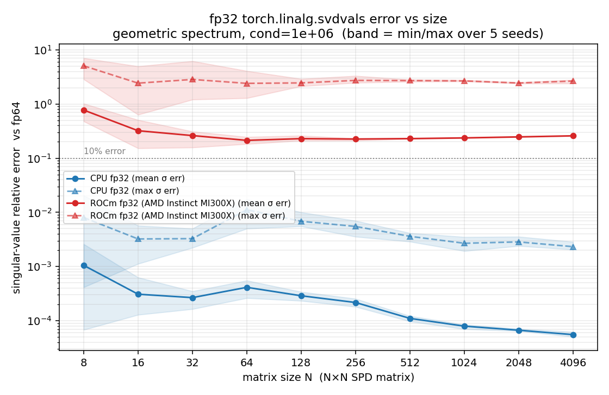

# What matrix structure triggers the ROCm fp32 SVD error?

We synthesize SPD matrices `A = Q diag(s) Qᵀ` (Q Haar-random orthogonal, built in
fp64) with a *prescribed* spectrum `s`, cast to fp32, and compare fp32 singular
values from CPU vs the ROCm GPU — each against the fp64 SVD of the **identical**
fp32 matrix, so the only variable is the fp32 SVD backend. Reproduce with
`structure_probe.py {shape,cond,size,gap,all}`. All numbers below: MI300X (gfx942),
ROCm 7.1, torch 2.10.0.dev+rocm7.1.

Metric: relative error of the singular values vs the fp64 reference —
`mean`, and `f>10%` = fraction of singular values off by more than 10%.
`EXCESS` = ROCm mean error ÷ CPU mean error (same precision, same input).

## Headline finding

The trigger is **spectral shape, not condition number.** ROCm fp32 SVD loses
accuracy when the spectrum has **many singular values with small relative gaps
spread smoothly over a wide dynamic range** (a power-law / geometric decay). It is
**size-independent** (an 8×8 matrix fails like a 4096×4096 one). A high condition
number caused by a *single* small outlier, or by *exactly* degenerate clusters,
does **not** trigger it.

This is exactly the spectrum of a real activation-covariance + ridge matrix
(`XᵀX + reg·I`), which is why AQUA-KV hit it. It also explains the earlier puzzle
that a *random* matrix at cond 8.5e9 looked fine: random (Marchenko–Pastur)
spectra are a well-separated bulk whose conditioning comes from one edge value —
not a dense multi-scale decay.

## 1. Spectrum shape (N=1025, cond=1e6)

| spectrum | CPU fp32 mean | ROCm fp32 mean | ROCm f>10% | excess | triggers? |
|---|---|---|---|---|---|
| **geometric** (smooth decay) | 7.8e-5 | **2.4e-1** | 0.43 | **3044×** | **YES** |
| **flat_tail** (signal + reg floor; mimics real) | 4.5e-3 | **3.0e-1** | 0.69 | **67×** | **YES** |
| linear (uniform spacing) | 9.9e-6 | 1.4e-4 | 0.00 | 14× | no |
| two_cluster (half=1, half=1e-6, exact) | 7.7e-2 | 5.3e-3 | 0.00 | 0× | no (ROCm beats CPU) |
| one_spike (1 huge + exact cluster) | 1.9e-3 | 4.7e-4 | 0.00 | 0× | no |

**Exact degeneracy is fine; smooth distinct decay is the killer.** This rules out a
clustering/deflation-of-equal-values explanation and points at resolution of
*close-but-distinct* singular values.

## 2. Condition number (N=1025, geometric spectrum)

| cond | CPU fp32 mean | ROCm fp32 mean | ROCm f>10% | excess |
|---|---|---|---|---|
| 1e1 | 2.6e-7 | 1.3e-4 | 0.00 | 508× |
| 1e3 | 6.6e-7 | 3.3e-4 | 0.00 | 495× |
| **1e4** | 1.9e-6 | **2.3e-2** | **0.07** | 12334× |
| 1e5 | 1.1e-5 | 1.3e-1 | 0.32 | 11133× |
| 1e6 | 8.1e-5 | 2.4e-1 | 0.44 | 2943× |
| 1e7 | 5.1e-4 | 3.3e-1 | 0.50 | 638× |
| 1e8 | 1.0e-2 | 3.8e-1 | 0.56 | 38× |

Two regimes for ROCm with a smooth spectrum: a **benign ~1e-4 accuracy baseline**
(≈1000× worse than CPU but harmless) up to cond ~1e3, then a **catastrophic
collapse at cond ≳ 1e4** (singular values wrong by tens of percent). CPU fp32 stays
clean until cond ~1e7–1e8. So ROCm tolerates ~3–4 orders of magnitude *less*
conditioning than CPU for these spectra.

## 3. Matrix size (geometric, cond=1e6)

| N | CPU fp32 mean | ROCm fp32 mean | ROCm f>10% |
|---|---|---|---|
| 8 | 9.4e-4 | 8.4e-1 | 0.29 |
| 64 | 2.6e-4 | 2.5e-1 | 0.34 |
| 512 | 1.2e-4 | 2.3e-1 | 0.42 |
| 1023 / 1024 / 1025 | 8.3e-5 | 2.4e-1 | 0.43 |
| 4096 | 5.2e-5 | 2.6e-1 | 0.46 |

**Essentially size-independent, no power-of-2 effect** (1023≈1024≈1025). Not a
tiling/alignment/workspace artifact — it is intrinsic to the fp32 SVD on a smooth
spectrum. Confirmed robust across random seeds.

The ROCm fp32 error (red) is flat and far above 10% for every size 8…4096, while
CPU fp32 (blue) stays ~1e-4; band = min/max over 5 seeds. Regenerate with
`python plot_size.py`.

## Practical predicate

A matrix is at risk on ROCm fp32 SVD/pinverse when **both**:
1. its spectrum decays smoothly with many singular values per decade (small
   relative gaps), and
2. its condition number is ≳ 1e4.

Real covariance/Gram/ridge matrices, kernel matrices, and most ill-conditioned
least-squares normal-equation matrices satisfy this. Use fp64, CPU, or an
SPD-appropriate solver (Cholesky) instead.
